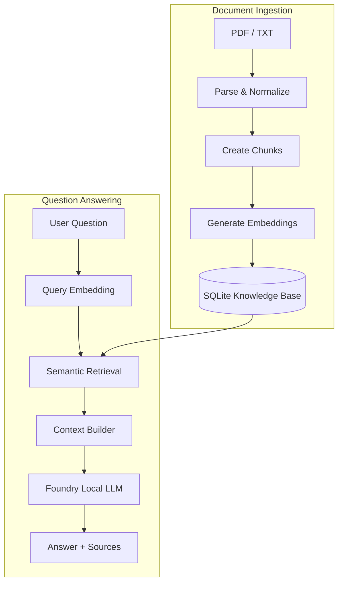

<div align="center">

# Local RAG AI Assistant

### Private, source-grounded document intelligence with Microsoft Foundry Local

Ask questions across your PDF and TXT documents without sending their contents to a cloud inference API.

<br>

[](https://github.com/microsoft/Foundry-Local)
[](https://www.python.org/)
[](https://fastapi.tiangolo.com/)
[](https://react.dev/)
[](https://www.sqlite.org/)
[](LICENSE)

<br>

[Overview](#overview) ·
[Features](#features) ·
[Architecture](#architecture) ·
[Installation](#installation) ·
[Usage](#usage) ·
[Limitations](#known-limitations)

</div>

---

## Overview

**Local RAG AI Assistant** is a full-stack Retrieval-Augmented Generation application that answers questions using information retrieved from user-selected documents.

The complete pipeline runs locally:

> document parsing → text chunking → embeddings → semantic retrieval → context construction → local generation

Uploaded documents, embeddings, prompts, and retrieved context remain on the user's machine. Answers are generated from the selected sources and displayed together with the passages used during retrieval.

### Why this project?

Cloud-based AI tools are convenient, but uploading private documents to external services is not always appropriate. This project explores a local-first alternative that combines:

- document-aware question answering,
- semantic retrieval,
- transparent source attribution,
- hallucination control,
- and offline language-model inference.

---

## Features

<table>
<tr>
<td width="50%" valign="top">

### Document intelligence

- PDF and TXT ingestion
- Shared text normalization
- Overlapping text chunking
- Local embedding generation
- SQLite document storage
- Normalized source paths

</td>
<td width="50%" valign="top">

### Grounded answers

- Semantic similarity search
- Document-filtered retrieval
- Configurable relevance threshold
- Structured source context
- Controlled fallback responses
- Source cards with similarity scores

</td>
</tr>
<tr>
<td width="50%" valign="top">

### Local-first architecture

- Microsoft Foundry Local inference
- No cloud model API required
- Local document processing
- Local knowledge base
- Streaming response generation
- Privacy-oriented workflow

</td>
<td width="50%" valign="top">

### Full-stack experience

- FastAPI backend
- React + TypeScript frontend
- Multiple document selection
- Markdown answer rendering
- Loading and error states
- Responsive interface

</td>
</tr>
</table>

---

## Project Status

> **v0.1 — Initial working release**

| Component | Status |
|---|:---:|
| PDF and TXT parsing | ✅ |
| Text normalization and chunking | ✅ |
| Local embedding generation | ✅ |
| SQLite knowledge base | ✅ |
| Semantic retrieval | ✅ |
| Document filtering | ✅ |
| Similarity threshold | ✅ |
| Context and prompt construction | ✅ |
| Local response generation | ✅ |
| FastAPI integration | ✅ |
| React interface | ✅ |
| Source attribution | ✅ |
| Multi-document retrieval | ✅ |
| End-to-end verification | ✅ |

The complete document-to-answer pipeline has been implemented and tested.

---

## Architecture



### Ingestion pipeline

1. The user uploads a PDF or TXT document.
2. The backend validates and parses the file.
3. Extracted text is normalized.
4. The text is divided into overlapping chunks.
5. A local embedding is generated for every chunk.
6. Documents, chunks, metadata, and embeddings are stored in SQLite.

| Chunking setting | Default |
|---|---:|
| Chunk size | `600` |
| Overlap | `80` |
| Minimum chunk size | `50` |

### Retrieval pipeline

1. The user selects one or more indexed documents.
2. The question is converted into an embedding.
3. Retrieval is limited to the selected document IDs.
4. Cosine similarity scores are calculated.
5. Results below the relevance threshold are removed.
6. The remaining chunks are converted into structured context.
7. The local model generates an answer using only that context.
8. The answer and its sources are streamed to the interface.

If no sufficiently relevant passage is found, the system returns a controlled fallback response instead of asking the model to guess.

---

## Source-Aware Context

Retrieved passages are sent to the model in structured source blocks:

```text
<SOURCE_1>
filename: example.pdf
source_path: data/uploads/example.pdf
document_id: 1
chunk_index: 3
similarity_score: 0.82

Retrieved document content...
</SOURCE_1>
```

This structure preserves provenance throughout the RAG pipeline and makes it possible to verify whether the displayed source matches the context used for the answer.

---

## Technology Stack

| Layer | Technology |
|---|---|
| Local inference | Microsoft Foundry Local |
| Chat model | Qwen2.5-0.5B |
| Backend | Python 3.12, FastAPI |
| Frontend | React, TypeScript, Vite |
| Database | SQLite |
| Retrieval | Local embeddings, cosine similarity |
| Documents | PDF, TXT |

---

## Installation

### Prerequisites

Before starting, install:

- Python 3.12
- Node.js and npm
- Git
- Microsoft Foundry Local
- A compatible local chat model and embedding model

### 1. Clone the repository

```bash
git clone https://github.com/ilydozttrk/Local-RAG-Foundry.git
cd Local-RAG-Foundry
```

### 2. Create a virtual environment

#### Windows PowerShell

```powershell
python -m venv .venv
.\.venv\Scripts\Activate.ps1
```

#### macOS or Linux

```bash
python3 -m venv .venv
source .venv/bin/activate
```

### 3. Install backend dependencies

```bash
pip install -r requirements.txt
```

### 4. Verify Foundry Local

```bash
foundry service status
foundry model list
```

Make sure the models configured for the project are available before starting the backend.

> Foundry Local model aliases and execution providers may vary depending on the installed version and hardware.

### 5. Install frontend dependencies

```bash
cd frontend
npm install
```

---

## Running the Application

The backend and frontend must run in separate terminals.

### Backend

From the repository root:

```powershell
.\.venv\Scripts\Activate.ps1
python main.py
```

The API runs at:

```text
http://127.0.0.1:8000
```

Interactive FastAPI documentation:

```text
http://127.0.0.1:8000/docs
```

### Frontend

In a second terminal:

```bash
cd frontend
npm run dev
```

Open:

```text
http://localhost:5173
```

> If Vite selects another port, make sure that the backend CORS configuration permits that frontend origin.

---

## Usage

1. Start Microsoft Foundry Local and the required models.
2. Run the FastAPI backend.
3. Run the React frontend.
4. Upload one or more PDF or TXT documents.
5. Wait for local indexing to finish.
6. Select the documents you want to search.
7. Ask a question whose answer appears in those documents.
8. Review both the generated answer and the retrieved source cards.

For the best results, use text-based PDFs with extractable content.

---

## Retrieval Configuration

Retrieval behavior can be calibrated through the following settings:

| Setting | Purpose |
|---|---|
| `top_k` | Maximum number of chunks returned |
| `min_similarity_score` | Minimum relevance score accepted |
| `document_ids` | Documents included in the search |
| Chunk size | Amount of text stored in each chunk |
| Overlap | Context shared between adjacent chunks |

These values should be adjusted using controlled retrieval tests. Changing them without evaluation may reduce answer quality or introduce irrelevant context.

---

## Validation

The v0.1 pipeline was tested with:

- PDF and TXT ingestion
- normalized `source_path` values
- chunk and embedding count verification
- relevant document questions
- completely unrelated questions
- retrieval and source matching
- hallucination fallback behavior
- multi-document queries
- empty questions
- missing document selection
- unsupported file types
- empty and corrupted documents
- frontend loading states
- controlled error messages
- responsive interface behavior
- complete document-to-answer workflows

No critical issue remained after the final smoke tests.

---

## Known Limitations

- Large documents require more ingestion time because parsing, chunking, and embedding generation run locally.
- Processing speed depends on document size, chunk count, model selection, and available hardware.
- The current `Qwen2.5-0.5B` model is lightweight, but its answer quality is more limited than that of larger models.
- Semantic retrieval currently uses direct cosine similarity, which may become slower as the knowledge base grows.
- Only PDF and TXT files are supported.
- Image-only scanned PDFs require OCR, which is not included in v0.1.
- The current release is designed primarily for local, single-user usage.

---

## Roadmap

Potential improvements for future releases:

- [ ] Compare Phi-4 Mini and larger Qwen models
- [ ] Add hybrid semantic and keyword retrieval
- [ ] Add a reranking stage
- [ ] Support OCR for scanned PDFs
- [ ] Add conversation memory
- [ ] Add background document indexing
- [ ] Display detailed ingestion progress
- [ ] Build an automated retrieval evaluation suite
- [ ] Add approximate nearest-neighbor search
- [ ] Provide Docker-based installation

---

## Privacy

The application is designed to run locally. Uploaded documents, generated embeddings, retrieved passages, and model prompts are processed on the user's device.

Generated databases, uploaded documents, environment files, and secrets should not be committed to version control.

---

## Project Background

This application was developed as a **20-day computer engineering internship project** focused on:

- Retrieval-Augmented Generation,
- offline and local AI systems,
- semantic search,
- backend and frontend integration,
- prompt grounding,
- and responsible source-aware generation.

The project evolved from an initial RAG prototype into a complete FastAPI and React application with local inference and end-to-end document retrieval.

---

## License

This project is available under the [MIT License](LICENSE).

---

<div align="center">

### Built locally. Grounded in your documents.

Microsoft Foundry Local · Python · FastAPI · React · SQLite

<br>

<sub>Developed by <a href="https://github.com/ilydozttrk">İlayda Öztürk</a></sub>

</div>