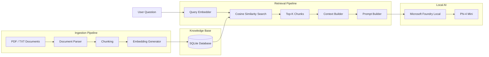
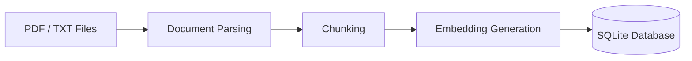
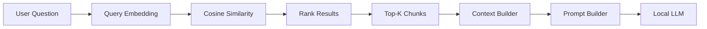
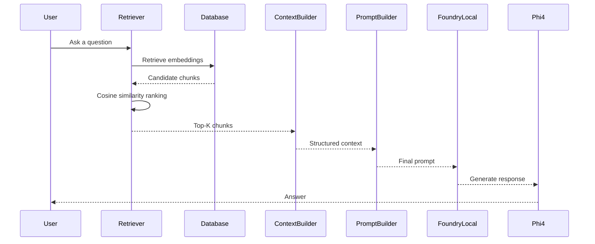
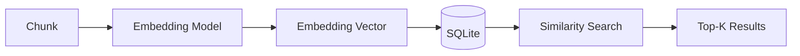
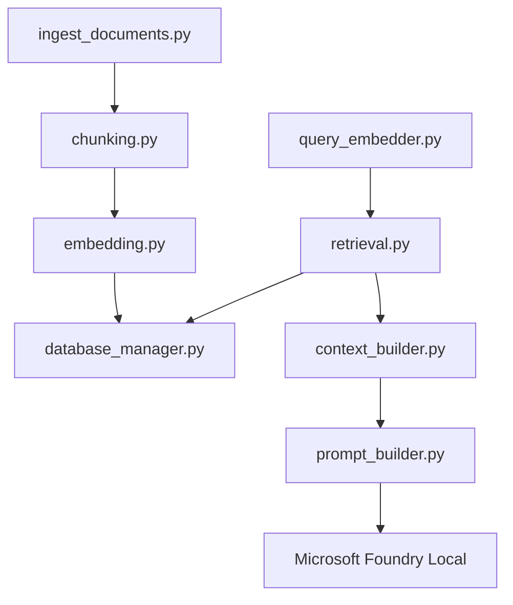

<h1 align="center">
Local RAG AI Assistant with Microsoft Foundry Local
</h1>

<p align="center">

A privacy-first Retrieval-Augmented Generation (RAG) assistant that runs locally using Microsoft Foundry Local, combining semantic retrieval with on-device large language models for grounded and offline question answering.

</p>

<p align="center">


</p>

---

## Table of Contents

- [Overview](#overview)
- [Key Features](#key-features)
- [Current Project Status](#current-project-status)
- [Why Microsoft Foundry Local?](#why-microsoft-foundry-local)
- [Architecture](#architecture)
- [Installation](#installation)
- [Project Structure](#project-structure)
- [Retrieval Pipeline](#retrieval-pipeline)
- [Database Design](#database-design)
- [Core Modules](#core-modules)
- [Usage](#usage)
- [Roadmap](#roadmap)
- [Future Improvements](#future-improvements)
- [License](#license)

---

# Overview

Large Language Models are powerful reasoning systems, but they are limited by the knowledge available at inference time. Without access to external information, they may produce outdated or hallucinated responses.

Retrieval-Augmented Generation (RAG) addresses this limitation by retrieving relevant information from an external knowledge base before generating a response. Instead of relying solely on model parameters, the language model receives grounded context extracted from user-provided documents.

This project implements a fully local RAG pipeline using **Microsoft Foundry Local**, enabling document ingestion, semantic retrieval, prompt construction, and local inference without relying on cloud services.

The entire workflow is designed around modular components, allowing each stage of the pipeline to be developed, tested, and extended independently.

Core objectives of the project include:

- Building a completely local AI assistant
- Eliminating dependency on cloud inference
- Creating a reusable RAG architecture
- Supporting semantic document search
- Producing grounded responses using retrieved context
- Maintaining a modular and extensible codebase

---

# Key Features

### Implemented

- Local Retrieval-Augmented Generation architecture
- PDF document ingestion
- TXT document ingestion
- Automatic document chunking
- SQLite knowledge base
- Local embedding generation
- Query embedding generation
- Cosine similarity retrieval
- Top-K semantic search
- Context construction
- Prompt generation for local LLM inference
- Modular project architecture

---

### Planned

- End-to-end response generation
- Streamlit user interface
- Source citation support
- Hybrid retrieval (semantic + keyword)
- Conversation memory
- Additional embedding model support
- Incremental document indexing
- Performance benchmarking

---

# Current Project Status

| Component | Status |
|------------|:------:|
| Development Environment | ✅ |
| Document Parsing | ✅ |
| Chunking Pipeline | ✅ |
| SQLite Database | ✅ |
| Embedding Generation | ✅ |
| Semantic Retrieval | ✅ |
| Context Builder | ✅ |
| Prompt Construction | ✅ |
| Local Response Generation | 🚧 |
| User Interface | ⏳ |

---

# Why Microsoft Foundry Local?

Unlike traditional cloud-based AI systems, Microsoft Foundry Local enables models to run directly on the user's machine. This significantly improves privacy, reduces latency, and removes dependency on external APIs during inference.

This project adopts a local-first approach for several reasons:

- Sensitive documents never leave the local environment.
- AI inference remains available without an internet connection.
- Development is independent of cloud API usage limits.
- Lower operational cost compared to hosted inference services.
- Full control over models, embeddings, and retrieval pipeline.

By combining Microsoft Foundry Local with Retrieval-Augmented Generation, the project demonstrates how modern AI assistants can provide grounded responses while remaining completely offline.

---

# Preview

The following sections describe the system architecture, project structure, retrieval workflow, implementation details, and development roadmap in depth.

---

# Installation

## Prerequisites

Before running the project, ensure that the following software is installed on your system.

| Requirement | Version |
|-------------|---------|
| Python | 3.12 or later |
| Microsoft Foundry Local | Latest |
| Git | Latest |
| SQLite | Included with Python |
| Windows | 10 / 11 (Recommended) |

---

## Clone the Repository

```bash
git clone https://github.com/ilydozttrk/Local-RAG-Foundry.git

cd Local-RAG-Foundry
```

---

## Create a Virtual Environment

Creating a dedicated virtual environment is recommended to isolate project dependencies.

### Windows

```bash
python -m venv .venv

.venv\Scripts\activate
```

### macOS / Linux

```bash
python3 -m venv .venv

source .venv/bin/activate
```

---

## Install Dependencies

Install all required Python packages.

```bash
pip install -r requirements.txt
```

---

## Configure Microsoft Foundry Local

Ensure Microsoft Foundry Local is correctly installed before running the project.

Verify the installation:

```bash
foundry service status
```

The service should report a healthy running state before continuing.

---

## Download Required Models

The project currently uses:

| Purpose | Model |
|----------|-------|
| Chat Model | Phi-4 Mini Instruct |
| Embedding Model | Qwen3 Embedding 0.6B |

Example:

```bash
foundry model list

foundry model run phi-4-mini

foundry model run qwen3-embedding-0.6b
```

> The exact commands may vary depending on your Microsoft Foundry Local installation and available model aliases.

---

# Quick Start

After completing the installation, the typical workflow is:

1. Add your documents to the `data/raw/` directory.
2. Run the ingestion pipeline.
3. Generate embeddings.
4. Store embeddings in the SQLite database.
5. Submit a query.
6. Retrieve the most relevant document chunks.
7. Build the prompt.
8. Send the prompt to the local language model.

The current implementation supports document ingestion, semantic retrieval, and prompt construction. Local response generation will be integrated in the next development phase.

---

# Project Structure

```text
Local-RAG-Foundry/
│
├── app/
│   ├── core/
│   ├── database/
│   ├── embeddings/
│   ├── retrieval/
│   ├── ingestion/
│   ├── prompts/
│   └── utils/
│
├── data/
│   ├── raw/
│   ├── processed/
│   └── database/
│
├── docs/
│   └── images/
│
├── tests/
│
├── requirements.txt
├── README.md
└── main.py
```

---

# Directory Overview

## app/

Contains the application's source code. Each module is responsible for a specific stage of the Retrieval-Augmented Generation pipeline.

---

## data/

Stores project data throughout the ingestion workflow.

- **raw/** — Original documents provided by the user.
- **processed/** — Cleaned and chunked documents.
- **database/** — SQLite database and related files.

---

## docs/

Contains documentation assets such as architecture diagrams, screenshots, and project illustrations used throughout the README.

---

## tests/

Includes scripts for validating individual components of the project during development.

---

## requirements.txt

Defines all Python package dependencies required to run the project.

---

## main.py

Entry point of the application. It orchestrates the overall execution flow and connects the project's core modules.

---

# Development Philosophy

The project is organized around a modular architecture where each stage of the Retrieval-Augmented Generation pipeline is implemented independently.

This separation of responsibilities provides several advantages:

- Easier debugging
- Improved maintainability
- Independent component testing
- Better scalability
- Simplified future extensions

Each module performs a single well-defined task, making the codebase easier to understand, maintain, and evolve over time.

---

# Next Section

The following section explains the complete system architecture, including document ingestion, embedding generation, semantic retrieval, prompt construction, and the interaction between all core components.

---

# Architecture

The project follows a modular Retrieval-Augmented Generation (RAG) architecture in which each component is responsible for a single stage of the pipeline. Documents are transformed into semantic embeddings during ingestion, while user queries follow a separate retrieval path that converges during prompt construction.

The separation between ingestion and retrieval enables the knowledge base to be built once and queried efficiently multiple times without reprocessing documents.

---

# High-Level Architecture



---

# System Workflow

The project consists of two independent workflows.

The **Ingestion Pipeline** runs only when new documents are added to the knowledge base.

The **Retrieval Pipeline** executes every time a user submits a question.

This separation minimizes redundant computation while keeping document retrieval fast and scalable.

---

# Ingestion Pipeline

The ingestion process transforms raw documents into searchable semantic knowledge.



### Step 1 — Document Parsing

Raw PDF and TXT documents are read from the local dataset.

---

### Step 2 — Chunking

Documents are divided into smaller semantic chunks.

Chunking improves retrieval precision by allowing the system to compare user queries against meaningful portions of text instead of entire documents.

---

### Step 3 — Embedding Generation

Each chunk is converted into a dense vector representation using the local embedding model.

Current embedding model:

- **Qwen3 Embedding 0.6B**

---

### Step 4 — Database Storage

Each generated embedding is stored together with its metadata inside SQLite.

Stored metadata includes:

- Chunk text
- Source document
- Chunk index
- Embedding vector
- Embedding model

---

# Retrieval Pipeline

Whenever a user asks a question, the retrieval workflow searches the knowledge base for the most relevant chunks.



---

## Query Embedding

The user's question is embedded using the same embedding model that generated the document vectors.

Using identical embedding spaces ensures meaningful similarity comparisons.

---

## Semantic Retrieval

The query vector is compared against every stored document embedding using cosine similarity.

The chunks with the highest similarity scores are selected.

---

## Top-K Selection

Only the highest-ranked chunks are forwarded to the next stage.

This reduces irrelevant context while keeping prompts compact.

---

## Context Construction

Retrieved chunks are merged into a structured context block.

This context becomes the external knowledge supplied to the language model.

---

## Prompt Construction

The prompt builder combines:

- System instructions
- Retrieved context
- User question

into a single prompt ready for local inference.

---

# End-to-End Data Flow



---

# Architectural Principles

The architecture follows several design principles.

### Local-First

Every stage of the pipeline runs locally without relying on cloud inference.

---

### Modular Design

Each component has a single responsibility and can be developed independently.

---

### Separation of Concerns

Document ingestion and query retrieval are completely separated.

This allows documents to be processed once while supporting unlimited future queries.

---

### Extensibility

Individual modules such as the embedding model, retrieval algorithm, or database backend can be replaced with minimal changes to the rest of the system.

---

### Reproducibility

The pipeline produces deterministic retrieval results given the same documents, embeddings, and similarity metric.

---

# Architecture Summary

The overall workflow can be summarized as:

```text
Documents
      │
      ▼
 Parsing
      │
      ▼
 Chunking
      │
      ▼
 Embeddings
      │
      ▼
 SQLite
────────────────────────────────────
      ▲
 User Question
      │
      ▼
 Query Embedding
      │
      ▼
 Semantic Retrieval
      │
      ▼
 Top-K Chunks
      │
      ▼
 Context Builder
      │
      ▼
 Prompt Builder
      │
      ▼
 Microsoft Foundry Local
      │
      ▼
      Response
```

---

# Database Design

The project uses **SQLite** as its local persistence layer for storing processed document chunks and their corresponding vector embeddings.

SQLite was selected because it provides a lightweight, serverless, and portable database solution that is well suited for local Retrieval-Augmented Generation applications.

Unlike production-scale vector databases, SQLite requires no external services while remaining sufficient for experimentation, learning, and small-to-medium knowledge bases.

---

## Stored Information

Each processed chunk is stored together with its semantic representation and metadata.

| Field | Description |
|---------|-------------|
| id | Unique identifier |
| source | Original document name |
| chunk_index | Position of the chunk inside the document |
| chunk_text | Text content of the chunk |
| embedding | Vector representation |
| embedding_model | Model used to generate embeddings |

This metadata enables efficient retrieval while preserving the relationship between retrieved chunks and their original documents.

---

## Database Workflow



---

# Embedding Strategy

Semantic search relies on dense vector representations rather than keyword matching.

Instead of comparing words directly, the system compares numerical representations that capture semantic meaning.

Current embedding model:

- **Qwen3 Embedding 0.6B**

Both document chunks and user questions are embedded using the same model to ensure they exist within a shared embedding space.

This allows cosine similarity to measure semantic closeness effectively.

---

# Retrieval Strategy

After a user submits a question, the retrieval module performs the following operations:

1. Generate the query embedding.
2. Load stored embeddings from SQLite.
3. Compute cosine similarity.
4. Rank all document chunks.
5. Select the highest scoring Top-K chunks.
6. Forward the selected chunks to the Context Builder.

Only relevant document sections are passed to the language model, reducing irrelevant context and improving response grounding.

---

## Similarity Search

The current implementation uses **Cosine Similarity**.

Advantages include:

- Scale-independent comparison
- Efficient semantic matching
- Widely adopted in modern RAG systems
- Compatible with dense embedding models

The retrieval component is intentionally modular, allowing future replacement with approximate nearest-neighbor search libraries if needed.

---

# Core Modules

The project is divided into independent modules, each responsible for a single stage of the Retrieval-Augmented Generation pipeline.

---

## ingest_documents.py

Responsible for processing raw documents before they become searchable.

Responsibilities:

- Read PDF files
- Read TXT files
- Invoke the chunking pipeline
- Generate embeddings
- Store processed data inside SQLite

---

## chunking.py

Transforms long documents into smaller semantic units.

Responsibilities:

- Split documents into chunks
- Preserve contextual continuity
- Prepare text for embedding generation

Chunking improves retrieval accuracy by reducing irrelevant information during similarity search.

---

## embedding.py

Provides document embedding generation.

Responsibilities:

- Load the embedding model
- Generate dense vector representations
- Return embeddings for database storage

---

## query_embedder.py

Processes user questions before retrieval.

Responsibilities:

- Receive user input
- Generate the query embedding
- Ensure compatibility with stored document vectors

Using the same embedding model for documents and queries ensures consistent semantic comparison.

---

## database_manager.py

Acts as the interface between the application and SQLite.

Responsibilities:

- Create database tables
- Insert processed chunks
- Store embeddings
- Retrieve embeddings
- Manage database operations

Keeping database logic isolated simplifies maintenance and future migration to another storage backend.

---

## retrieval.py

Implements semantic retrieval.

Responsibilities:

- Load embeddings
- Compute cosine similarity
- Rank retrieved chunks
- Return Top-K results

This module forms the core of the Retrieval-Augmented Generation pipeline.

---

## context_builder.py

Transforms retrieved chunks into structured context.

Responsibilities:

- Merge retrieved passages
- Remove unnecessary formatting
- Prepare context for prompt construction

The Context Builder bridges semantic retrieval and prompt engineering.

---

## prompt_builder.py

Constructs the final prompt supplied to the local language model.

Responsibilities:

- Insert system instructions
- Inject retrieved context
- Append the user question
- Produce the final inference prompt

Separating prompt construction from retrieval improves maintainability and simplifies experimentation with different prompt templates.

---

# Module Dependencies



---

# Design Philosophy

The project follows a **single responsibility** architecture.

Each module performs one clearly defined task.

This design provides:

- Better maintainability
- Easier debugging
- Independent testing
- Simpler future extensions
- Cleaner project organization

Rather than creating a monolithic application, the pipeline is intentionally divided into reusable components that can evolve independently as the project grows.

---

# Usage

Once the knowledge base has been created, the Retrieval-Augmented Generation pipeline follows a straightforward workflow. A user submits a question, the system retrieves the most relevant document chunks, constructs a grounded prompt, and sends it to the local language model for inference.

The retrieval process is entirely local and does not require an internet connection.

---

## Running the Project

Activate the virtual environment and execute the application.

```bash
python main.py
```

Depending on the current development stage, individual modules may also be executed independently for testing purposes.

---

## Typical Workflow

```text
1. Add documents to data/raw/

            ↓

2. Run document ingestion

            ↓

3. Generate embeddings

            ↓

4. Store vectors in SQLite

            ↓

5. Ask a question

            ↓

6. Retrieve relevant chunks

            ↓

7. Build contextual prompt

            ↓

8. Generate response locally
```

---

# Example Query

The following illustrates a typical interaction with the system.

### User Question

```text
What are the main advantages of Retrieval-Augmented Generation?
```

---

### Retrieved Context

```text
Retrieval-Augmented Generation combines external knowledge retrieval
with language model generation.

Instead of relying solely on model parameters,
the system retrieves relevant documents before generating an answer.

This approach significantly reduces hallucinations
and improves factual accuracy.
```

---

### Prompt Sent to the Model

```text
System:

You are a helpful AI assistant.

Use ONLY the provided context when answering the user's question.

If the answer cannot be found in the retrieved context,
respond that the information is unavailable.

----------------------------

Context:

...

----------------------------

Question:

What are the main advantages of Retrieval-Augmented Generation?
```

---

### Expected Response

```text
Retrieval-Augmented Generation improves factual accuracy by
retrieving relevant information from an external knowledge base
before response generation.

This reduces hallucinations while allowing the language model
to answer using up-to-date contextual information.
```

---

# Prompt Engineering

Prompt construction is intentionally separated from retrieval logic.

This makes it possible to experiment with different prompt templates without modifying retrieval or database components.

The current prompt consists of three sections:

1. System Instructions
2. Retrieved Context
3. User Question

This structure encourages grounded generation while minimizing hallucinations.

---

## Grounding Strategy

The language model is instructed to answer **only** using the retrieved context.

If sufficient evidence cannot be found inside the retrieved document chunks, the model should explicitly indicate that the requested information is unavailable.

This behavior is preferred over generating unsupported or speculative responses.

---

# Design Decisions

Several architectural decisions were made during development to prioritize simplicity, modularity, and local execution.

---

## Why Microsoft Foundry Local?

The project is intended to operate entirely offline.

Microsoft Foundry Local provides an efficient way to run language models and embedding models directly on the user's machine without relying on cloud APIs.

---

## Why SQLite?

SQLite offers a lightweight, serverless database that is sufficient for local semantic search experiments while requiring minimal setup.

Its portability also makes the project easy to distribute and reproduce.

---

## Why Cosine Similarity?

Cosine similarity is computationally efficient and widely used in Retrieval-Augmented Generation systems.

It provides reliable semantic matching without requiring additional infrastructure.

---

## Why Modular Components?

Each stage of the pipeline has been isolated into an independent module.

This approach simplifies testing, debugging, maintenance, and future feature development.

---

## Why Local Retrieval?

Keeping both document processing and inference local ensures:

- Better privacy
- Lower latency
- No API costs
- Offline availability
- Full control over user data

---

# Current Progress

The project is currently focused on building a complete local Retrieval-Augmented Generation pipeline.

### Completed

- Development environment
- Microsoft Foundry Local integration
- Document ingestion
- PDF parsing
- TXT parsing
- Chunking pipeline
- SQLite database
- Embedding generation
- Query embeddings
- Semantic retrieval
- Context builder
- Prompt construction

---

### In Progress

- Local response generation
- End-to-end pipeline integration
- Testing and validation

---

### Planned

- Streamlit interface
- Source citation support
- Conversation memory
- Hybrid retrieval
- Incremental indexing
- Performance evaluation

---

# Performance Goals

The project prioritizes correctness and modularity over premature optimization.

Future evaluation will include:

- Retrieval precision
- Response quality
- Latency
- Memory usage
- Embedding performance
- Scalability across larger document collections

---

# Next Section

The final section presents the development roadmap, future improvements, acknowledgements, references, and licensing information.

---

# Roadmap

The project is being developed incrementally, with each milestone introducing a new capability while maintaining a modular and testable architecture.

| Phase | Status |
|--------|:------:|
| Environment Setup | ✅ Completed |
| Microsoft Foundry Local Integration | ✅ Completed |
| Document Ingestion Pipeline | ✅ Completed |
| Document Chunking | ✅ Completed |
| SQLite Knowledge Base | ✅ Completed |
| Embedding Generation | ✅ Completed |
| Semantic Retrieval | ✅ Completed |
| Context Construction | ✅ Completed |
| Prompt Construction | ✅ Completed |
| Local Response Generation | 🚧 In Progress |
| End-to-End Integration | ⏳ Planned |
| User Interface | ⏳ Planned |
| Performance Evaluation | ⏳ Planned |
| Documentation & Final Release | ⏳ Planned |

---

# Future Improvements

The modular architecture makes it straightforward to extend the project with additional capabilities.

Potential future enhancements include:

- Streamlit-based graphical interface
- Source citation support
- Hybrid retrieval (semantic + keyword)
- Conversation memory
- Multiple embedding model support
- Incremental document indexing
- Approximate nearest-neighbor retrieval
- Document metadata filtering
- Reranking models
- Evaluation framework for retrieval quality
- Automated benchmark reporting
- Docker support
- Cross-platform packaging

These improvements are intentionally planned for future development to keep the current implementation focused on establishing a reliable local Retrieval-Augmented Generation pipeline.

---

# References

The implementation and architectural decisions are based on concepts and documentation from the following resources.

### Microsoft

- Microsoft Foundry Local Documentation
- Microsoft AI Foundry Documentation

### Retrieval-Augmented Generation

- Lewis et al. — Retrieval-Augmented Generation for Knowledge-Intensive NLP Tasks (2020)

### Embedding Models

- Qwen3 Embedding Models

### Additional Resources

- SQLite Documentation
- Python Documentation

---

# License

This project is licensed under the MIT License.

See the **LICENSE** file for additional information.

---

# Acknowledgements

This project was developed as part of a personal learning journey focused on local artificial intelligence systems, Retrieval-Augmented Generation (RAG), and Microsoft Foundry Local.

Special thanks to the Microsoft AI documentation and the open-source community for providing valuable educational resources that supported the development of this project.

---

<div align="center">

**Built with Microsoft Foundry Local, Python, SQLite, and a passion for local AI.**

</div>
