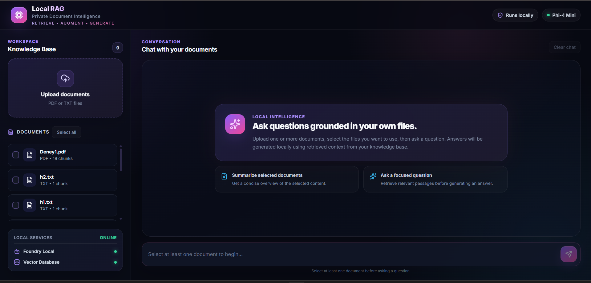
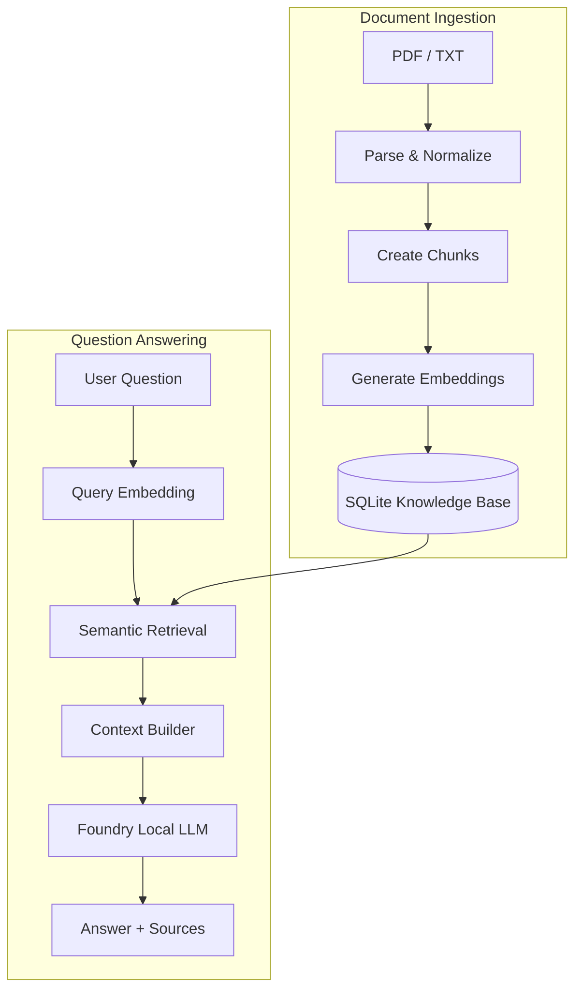

# Local RAG AI Assistant

Ask questions across your own documents — locally, privately, and with sources.

A full-stack **Retrieval-Augmented Generation (RAG)** application powered by **Microsoft Foundry Local**.

The system parses PDF and TXT files, divides their content into overlapping chunks, generates local embeddings, retrieves the most relevant passages, and asks a locally running language model to answer using only that context.

> **Current release:** `v0.1` — The complete document-to-answer pipeline is implemented and manually verified.

---

# Table of Contents

- [Overview](#overview)
- [Features](#features)
- [Architecture](#architecture)
- [Document Ingestion Pipeline](#document-ingestion-pipeline)
- [Retrieval Pipeline](#retrieval-pipeline)
- [Source-Aware Context](#source-aware-context)
- [Technology Stack](#technology-stack)
- [Installation](#installation)
- [Running the Application](#running-the-application)
- [Usage](#usage)
- [Retrieval Configuration](#retrieval-configuration)
- [Validation](#validation)
- [Known Limitations](#known-limitations)
- [Roadmap](#roadmap)
- [Privacy](#privacy)
- [Project Background](#project-background)
- [License](#license)

---

# Overview

Local RAG AI Assistant is a local-first document question-answering system.

The application is designed around three principles:

- **Local processing** — Documents and prompts are processed on the user's device.
- **Grounded generation** — Answers are produced from retrieved document passages.
- **Source transparency** — Retrieved sources and similarity scores are shown with the answer.

## Application Screenshots

| Local Knowledge Base | Grounded Answer |
|---|---|
|  |  |
| Local knowledge base and document selection | Generated answer with retrieved sources |

---

# Features

## Document Pipeline

- PDF and TXT ingestion
- Shared text normalization
- Overlapping text chunking
- Local embedding generation
- Normalized source paths
- SQLite document storage

## Semantic Retrieval

- Cosine-similarity search
- Multi-document filtering
- Configurable relevance threshold
- Structured source context
- Similarity scores
- Controlled fallback responses

## Local-First AI

- Microsoft Foundry Local inference
- Phi-4 Mini chat model
- No cloud model API required
- Local document processing
- Local knowledge base
- Privacy-oriented workflow

## Full-Stack Interface

- FastAPI backend
- React and TypeScript frontend
- Multiple document selection
- Markdown answer rendering
- Source cards
- Loading and error states

---

# Architecture



---

# Document Ingestion Pipeline

After a document is uploaded, the system performs the following steps:

1. Parse and normalize text from the PDF or TXT file.
2. Divide the normalized text into overlapping chunks.
3. Generate a local embedding for each chunk.
4. Store documents, chunks, embeddings, and metadata in SQLite.

## Default Chunking Settings

| Setting | Default |
|---|---:|
| Chunk size | `600` |
| Overlap | `80` |
| Minimum chunk size | `50` |

---

# Retrieval Pipeline

When the user submits a question, the following process is executed:

1. The user selects one or more indexed documents.
2. The question is converted into an embedding.
3. Retrieval is limited to the selected document IDs.
4. Cosine similarity scores are calculated.
5. Passages below the relevance threshold are removed.
6. Relevant chunks are converted into structured context.
7. Phi-4 Mini generates an answer using that context.
8. The completed answer and its source cards are returned to the interface.

If no sufficiently relevant passage is found, the system returns a controlled fallback instead of asking the model to guess.

---

# Source-Aware Context

Retrieved passages are sent to the model in structured source blocks:

```text
<SOURCE_1>
filename: example.pdf
source_path: data/uploads/example.pdf
document_id: 1
chunk_index: 3
similarity_score: 0.82

Retrieved document content...
</SOURCE_1>
```

This format preserves provenance throughout the RAG pipeline and makes it possible to verify whether the displayed source matches the context used to produce the answer.

---

# Technology Stack

| Layer | Technology |
|---|---|
| Local inference | Microsoft Foundry Local |
| Chat model | Phi-4 Mini |
| Backend | Python 3.12, FastAPI |
| Frontend | React, TypeScript, Vite |
| Database | SQLite |
| Retrieval | Local embeddings, cosine similarity |
| Documents | PDF, TXT |

---

# Installation

## Prerequisites

Before starting, install:

- Python 3.12
- Node.js and npm
- Git
- Microsoft Foundry Local
- The local models configured for the project

## 1. Clone the Repository

```bash
git clone https://github.com/ilydozttrk/Local-RAG-Foundry.git
cd Local-RAG-Foundry
```

## 2. Create a Virtual Environment

### Windows PowerShell

```powershell
python -m venv .venv
.\.venv\Scripts\Activate.ps1
```

### macOS / Linux

```bash
python3 -m venv .venv
source .venv/bin/activate
```

## 3. Install Backend Dependencies

```bash
pip install -r requirements.txt
```

## 4. Verify Foundry Local

```bash
foundry service status
foundry model list
```

Foundry Local model aliases and execution providers may vary depending on the installed version and available hardware.

## 5. Install Frontend Dependencies

```bash
cd frontend
npm install
```

---

# Running the Application

The backend and frontend run in separate terminals.

## Terminal 1 — Backend

From the repository root:

```powershell
.\.venv\Scripts\Activate.ps1
uvicorn backend.api:app --reload
```

| Service | Address |
|---|---|
| FastAPI backend | [http://127.0.0.1:8000](http://127.0.0.1:8000) |
| Interactive API docs | [http://127.0.0.1:8000/docs](http://127.0.0.1:8000/docs) |

## Terminal 2 — Frontend

```bash
cd frontend
npm run dev
```

Open [http://localhost:5173](http://localhost:5173) in the browser.

If Vite selects another port, make sure the backend CORS configuration permits that frontend origin.

---

# Usage

1. Start Microsoft Foundry Local and the required models.
2. Run the FastAPI backend.
3. Run the React frontend.
4. Upload one or more PDF or TXT files.
5. Wait for local indexing to finish.
6. Select the documents you want to search.
7. Ask a question whose answer appears in those documents.
8. Review the generated answer and retrieved source cards.

For the best results, use text-based PDFs with extractable content.

---

# Retrieval Configuration

| Setting | Purpose |
|---|---|
| `top_k` | Maximum number of chunks returned |
| `min_similarity_score` | Minimum accepted relevance score |
| `document_ids` | Documents included in the search |
| Chunk size | Amount of text stored in each chunk |
| Overlap | Context shared between adjacent chunks |

These values should be calibrated with controlled retrieval tests. Changing them without evaluation may reduce answer quality or introduce irrelevant context.

---

# Validation

The `v0.1` release was manually verified with:

- ✅ PDF and TXT ingestion
- ✅ Normalized `source_path` values
- ✅ Chunk and embedding count checks
- ✅ Relevant and unrelated questions
- ✅ Retrieval and source matching
- ✅ Hallucination fallback behavior
- ✅ Multi-document queries
- ✅ Empty questions and missing document selection
- ✅ Unsupported, empty, and corrupted documents
- ✅ Frontend loading and controlled error states
- ✅ Responsive interface behavior
- ✅ Complete document-to-answer workflows

No critical issue remained after the final manual smoke tests. An automated test suite is planned for a future release.

---

# Known Limitations

- Large documents take longer to ingest because parsing, chunking, and embedding generation run locally.
- Processing speed depends on document size, chunk count, model selection, and available hardware.
- Phi-4 Mini is lightweight, but its answer quality is more limited than larger models.
- Direct cosine-similarity search may become slower as the knowledge base grows.
- Only PDF and TXT files are supported.
- Image-only scanned PDFs require OCR, which is not included in `v0.1`.
- The current release is intended primarily for local, single-user usage.

---

# Roadmap

- [ ] Compare Phi-4 Mini with larger local models
- [ ] Add hybrid semantic and keyword retrieval
- [ ] Add a reranking stage
- [ ] Support OCR for scanned PDFs
- [ ] Add conversation memory
- [ ] Add background document indexing
- [ ] Display detailed ingestion progress
- [ ] Build an automated retrieval evaluation suite
- [ ] Add approximate nearest-neighbor search
- [ ] Provide Docker-based installation

---

# Privacy

Uploaded documents, generated embeddings, retrieved passages, and model prompts are processed on the user's device.

Generated databases, uploaded documents, environment files, and secrets should not be committed to version control.

---

# Project Background

This application was developed as a 20-day computer engineering internship project focused on:

- Retrieval-Augmented Generation
- Offline and local AI systems
- Semantic search
- Backend and frontend integration
- Prompt grounding
- Source-aware generation

The project evolved from an initial RAG prototype into a complete FastAPI and React application with local inference and end-to-end document retrieval.

---

# License

This project is available under the [MIT License](LICENSE).

**Developed by [İlayda Öztürk](https://github.com/ilydozttrk)**